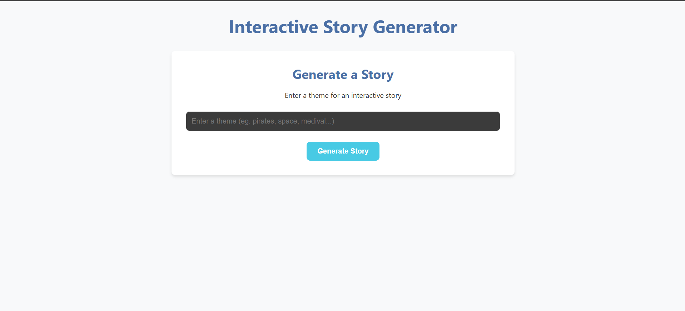
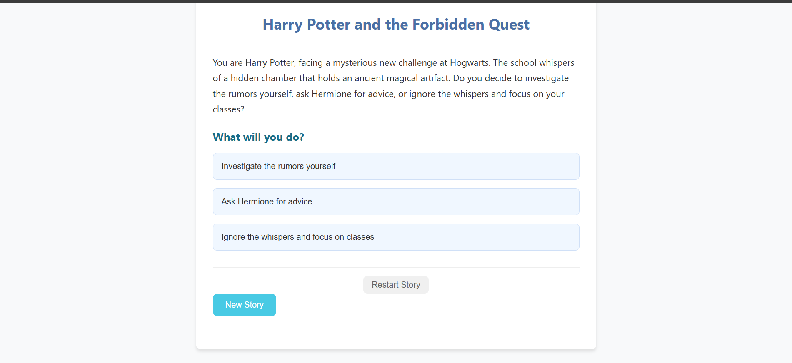

# 📖 AI Story Generation Platform

An interactive full-stack storytelling platform that generates dynamic, choice-driven stories using Large Language Models (LLMs). Users can create personalized adventures where every decision influences the narrative, resulting in unique branching storylines.

---

## 🚀 Features

- 🎭 Generate AI-powered stories from a custom theme
- 🌳 Dynamic branching narratives based on user choices
- ✨ Multiple story paths and endings
- 💾 Persistent story storage using PostgreSQL
- ⚡ Fast REST APIs built with FastAPI
- 🎨 Responsive React frontend
- 🤖 LangChain + OpenAI integration for story generation
- 📚 Story history and progression tracking
- 🔄 Real-time interaction between frontend and backend

---

## 🛠️ Tech Stack

### Frontend
- React.js
- Vite
- CSS

### Backend
- FastAPI
- SQLAlchemy
- PostgreSQL
- Pydantic

### AI
- LangChain
- OpenAI GPT

### Tools
- Git
- GitHub
- Postman

---

## 📂 Project Structure

```
AI-Story-Generation-Platform/
│
├── frontend/
│   ├── public/
│   ├── src/
│   ├── package.json
│   └── vite.config.js
│
├── backend/
│   ├── core/
│   ├── db/
│   ├── models/
│   ├── routers/
│   ├── schemas/
│   ├── main.py
│   └── requirements.txt
│
└── README.md
```

---

## ⚙️ Installation

### 1. Clone the repository

```bash
git clone https://github.com/<your-username>/AI-Story-Generation-Platform.git
```

```bash
cd AI-Story-Generation-Platform
```

---

## Backend Setup

Navigate to the backend folder

```bash
cd backend
```

Create a virtual environment

```bash
python -m venv .venv
```

Activate the virtual environment

### Windows

```bash
.venv\Scripts\activate
```

### macOS/Linux

```bash
source .venv/bin/activate
```

Install dependencies

```bash
pip install -r requirements.txt
```

Create a `.env` file

```env
DATABASE_URL=your_database_url
OPENAI_API_KEY=your_openai_api_key
```

Run the backend

```bash
python main.py
```

Backend will be available at

```
http://localhost:8000
```

Swagger Documentation

```
http://localhost:8000/docs
```

---

## Frontend Setup

Navigate to the frontend folder

```bash
cd frontend
```

Install dependencies

```bash
npm install
```

Create a `.env` file

```env
VITE_API_URL=http://localhost:8000
```

Start the development server

```bash
npm run dev
```

Frontend will run at

```
http://localhost:5173
```

---

## 📌 API Endpoints

| Method | Endpoint | Description |
|---------|----------|-------------|
| POST | /stories | Create a new story |
| GET | /stories | Fetch all stories |
| GET | /stories/{id} | Get story details |
| GET | /stories/{id}/complete | Retrieve complete story tree |
| POST | /stories/{id}/continue | Continue a story from a selected option |

---

## 🧠 How It Works

1. User enters a story theme.
2. The frontend sends a request to the FastAPI backend.
3. LangChain constructs prompts for the LLM.
4. OpenAI generates the story along with multiple choices.
5. The story and branching nodes are stored in PostgreSQL.
6. Users select an option to continue the narrative.
7. The process repeats until an ending is reached.

---

## 🏗️ Architecture

```
             React Frontend
                    │
                    ▼
             FastAPI Backend
                    │
          ┌─────────┴─────────┐
          ▼                   ▼
     LangChain           PostgreSQL
          │
          ▼
      OpenAI GPT
```

---

## 📸 Screenshots

### Home Page



---

### Story Generation



---

## 🔮 Future Enhancements

- User authentication
- Story bookmarking
- Story sharing
- Story export (PDF)
- AI-generated illustrations
- Voice narration
- Multiplayer collaborative storytelling
- Theme-based templates

---

## 👨‍💻 Author

**Narotham**

GitHub: https://github.com/k14reddy

LinkedIn: https://linkedin.com/in/kotla-narotham-reddy-574503325/

---

## ⭐ If you found this project helpful, consider giving it a star!